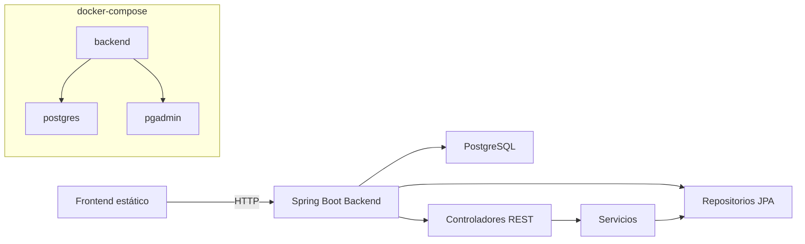

# Documentación de API - Book Journal Back-end

## 1. Visión general

Esta sección define el propósito del backend y las convenciones principales. Explica por qué se eligió Spring Boot y PostgreSQL: escalabilidad, facilidad de configuración y compatibilidad con contenedores Docker.

Proyecto: `back-end` (Java Spring Boot + PostgreSQL)

- Base: Spring Boot 3.x, JPA/Hibernate, Spring Web, Spring Data, Spring Security (permite todo).
- DB: PostgreSQL.
- Capa de rutado: `/api/*` para recursos.
- CORS habilitado (`@CrossOrigin("*")`) para frontend estático.
- No hay manejo de excepciones personalizado; los casos nulos devuelven 200 con body `null` a menos que la infraestructura devuelva 500.

## 1.1 Descripción del proyecto y dominio elegido

Esta sección detalla el contexto funcional: una aplicación para seguimiento de lectura personal. El dominio (libros, usuarios, lista de deseos) se eligió por su simplicidad educativa y cobertura de patrones CRUD.

Book Journal es una API para gestionar usuarios, libros leídos y listas de deseos en un sistema personal de seguimiento de lectura. El dominio es "lectura personal" / "gestión de biblioteca personal" y la aplicación cubre:

- Registro y login de usuarios.
- CRUD de libros con estado de lectura y calificación.
- Gestión de lista de deseos de libros.

## 1.2 Stack tecnológico utilizado

Aquí se describe qué herramientas y frameworks se emplean y el motivo.
- Java 21 (OpenJDK / Eclipse Temurin) por compatibilidad con Spring Boot 3.
- Spring Boot 3.x para rápida configuración, arranque integrado y ecosistema.
- Spring Web para crear controladores REST.
- Spring Data JPA para acceso a datos con repositorios sin boilerplate.
- Spring Security cargado con permiso abierto para simplificar desarrollo inicial.
- Lombok (solo en la entidad `Libro` para getters/setters automáticos) para reducción de código.
- PostgreSQL 15 por ser DB relacional robusta y bien soportada en producción.
- Docker / docker-compose para contenerización y despliegue reproducible.

## 1.3 URL de acceso a la aplicación desplegada

Se indica la ruta de base porque los consumidores API (frontend o QA) deben saber dónde apuntar; en entorno local se usa `localhost` y en producción se sustituye por el dominio final.

- Local (dev): `http://localhost:8080`
- Documentación: no incluido UI Swagger, se usa README + `api-documentation.md`.

## 1.4 Diagrama de arquitectura del sistema

El diagrama muestra componentes y flujos principales: frontend que llama REST, backend con servicios y persistencia, y el despliegue en contenedores con PostgreSQL y pgAdmin.



## 1.5 Credenciales de prueba

Se documentan credenciales de servicios para pruebas locales con docker-compose, evitando ambigüedades durante la verificación del despliegue.

- PostgreSQL (docker-compose):
  - `user`: postgres
  - `password`: postgres
  - `db`: book_journal

- pgAdmin (docker-compose):
  - `email`: admin@admin.com
  - `password`: admin

- Usuario API ejemplo:
  - `correo`: pruebas@demo.com
  - `password`: 1234

## 1.6 Problemas encontrados y soluciones

Se listan aquí hallazgos técnicos de calidad que se detectaron con análisis rápido, para que quien replique el código tenga la lista de risks y posibles acciones.

- Login devuelve `null` cuando las credenciales fallan: se recomienda retornar `401 Unauthorized` o excepción clara.
- GET de entidad inexistente devuelve `null` (200) en vez de 404. Se debe agregar control de respuesta con `ResponseEntity`.
- Contraseñas guardadas en texto plano: en producción usar BCrypt y no exponer el campo `password`.
- No hay validación de requests (ej. campos obligatorios); se recomienda `@Valid` y `@NotNull/@NotEmpty`.
- CORS amplio (`*`) no es seguro en producción; restringir a dominio frontend.

## 1.7 ¿Cómo se replantearía para producción?

Esta parte explica qué cambios son recomendados:
- Cambiar lógica de usuario para no devolver password y usar un DTO de respuesta.
- Implementar `@ControllerAdvice` para estandarizar errores y evitar fugas de stacktrace.
- Añadir pruebas unitarias e integración con `@SpringBootTest`.
- Fix para control de 404/401:
  - `ResponseEntity.notFound().build()` cuando no existe recurso.
  - `ResponseEntity.status(HttpStatus.UNAUTHORIZED).build()` en login fallido.

## 2. Estructura del proyecto

La arquitectura sigue patrón **MVC/Capas** separando responsabilidades, facilitando testing y mantenimiento:

```
back-end/
  src/main/java/com/example/back_end/
    controller/      -> API REST (capa presentación)
      Reciben requests HTTP, validan, invocan servicios
      DeseoController.java
      LibroController.java
      UsuarioController.java
    model/           -> Entidades JPA (capa persistencia)
      Representan tablas con anotaciones Hibernate
      Deseo.java
      Libro.java
      Usuario.java
    repository/      -> Interfaces Spring Data (acceso datos)
      Generan SQL automáticamente desde métodos
      DeseoRepository.java
      LibroRepository.java
      UsuarioRepository.java
    service/         -> Lógica negocio (capa negocios)
      Reglas y orquestación entre controlador y repo
      DeseoService.java
      LibroService.java
      UsuarioService.java
    config/
      SecurityConfig.java (CORS, autenticación, etc.)
  Dockerfile        -> Empaquetación contenedor
  docker-compose.yml -> Orquestación servicios (backend+DB)
  pom.xml           -> Dependencias Maven
  src/main/resources/application.properties -> Config app
```

**¿Por qué esta estructura?**
- Separación capas: cambios aislados sin afectar otras.
- Reutilización: servicios usados por múltiples controladores.
- Testing: cada capa testeable independientemente.
- Escalabilidad: nuevas entidades duplican patrón (controller→service→repo→model).

## 3. Modelos de datos

Representan tablas en BD. Anotados con `@Entity` para mapeo automático Hibernate.

### `Usuario` - Cuenta personal

**Tabla**: `usuario`

- **id**: Long (PK, autogenerado)
  - Identificador único de cada usuario.
- **nombre**: String
  - Nombre completo o parcial del usuario. Informativo.
- **correo**: String
  - Email único de autenticación. **IMPORTANTE**: se recomienda agregar `@Column(unique=true)` para evitar duplicados.
  - Usado en login para encontrar usuarios.
- **password**: String
  - Contraseña. **RIESGO SEGURIDAD**: guardada en texto plano. En producción debe hashearse con BCrypt.
- **fechaNacimiento**: String
  - Flexible al ser String. Se recomienda usar `LocalDate` para validación de fechas.
- **generoFavorito**: String
  - Preferencia literaria del usuario (ej. "Ficción", "Romance", "No ficción").
  - Usado para recomendaciones o filtros.
- **promedioLectura**: String
  - Métrica informativa (ej. "2 libros/mes"). Estadística voluntaria del usuario.

### `Libro` - Libro en catálogo personal

**Tabla**: `libros`

**Nota especial**: Usa Lombok `@Data` para generar automáticamente getters, setters, equals(), hashCode() y toString().

- **id**: Long (PK, autogenerado)
  - Identificador único del libro.
- **titulo**: String
  - Título del libro.
- **autor**: String
  - Nombre del autor.
- **genero**: String
  - Clasificación literaria (ej. "Ficción Científica", "Novela Negra").
- **resena**: String (TEXT, `@Column(columnDefinition="TEXT")`)
  - Descripción detallada o comentario del usuario. 
  - Tipo TEXT permite textos largos (hasta 65KB) a diferencia de VARCHAR limitado.
  - Usado para guardar análisis, opinión o sinopsis.
- **inicio**: LocalDate
  - Fecha cuando el usuario comenzó a leer el libro.
  - Formato: YYYY-MM-DD.
- **fin**: LocalDate
  - Fecha cuando terminó de leer. Puede ser **null** si aún está en lectura.
  - **IMPORTANTE**: Este campo determina si un libro es "leído" (fin != null) o "en progreso" (fin == null).
- **calificacion**: Integer
  - Puntuación subjetiva del usuario (ej. 1-10 o 1-5).
  - Null si no ha calificado aún.

### `Deseo` - Libro deseado (lista de deseos)

**Tabla**: `deseo`

- **id**: Long (PK, autogenerado)
  - Identificador único.
- **titulo**: String
  - Nombre del libro que el usuario desea leer en el futuro.
  - **Nota**: estructura simplificada; solo título. No almacena autor, género u otros detalles (se podrían agregar en futuro).

## 4. Repositorios

Los repositorios son interfaces que heredan de `JpaRepository` y actúan como intermediarios entre servicios y BD. Spring Data implementa automáticamente generando SQL.

**¿Por qué existen?**
- Abstracción: permiten cambiar BD sin modificar servicios.
- CRUD automático: `save()`, `findById()`, `delete()`, `findAll()` heredados gratis.
- Consultas custom: métodos declarativos evitan escribir SQL manualmente.

### `UsuarioRepository`

**Extiende**: `JpaRepository<Usuario, Long>`
(Proporciona automáticamente: save, delete, findAll, findById, count, etc.)

**Métodos custom**:

- `Optional<Usuario> findByCorreo(String correo)`
  - **Función**: busca un usuario por su correo electrónico.
  - **Parámetro**: correo (String).
  - **Retorna**: `Optional<Usuario>` (puede estar vacío si no existe).
  - **SQL generado**: `SELECT * FROM usuario WHERE correo = ?`
  - **Caso uso**: validar email en login, comprobar unicidad en registro.
  - **Nota**: Spring Data genera esta query leyendo el nombre del método (`findBy` + `Correo`).

### `LibroRepository`

**Extiende**: `JpaRepository<Libro, Long>`

**Métodos custom**:

- `List<Libro> findByFinIsNotNull()`
  - **Función**: retorna todos los libros donde `fin` NO es nulo (ya terminados).
  - **SQL generado**: `SELECT * FROM libros WHERE fin IS NOT NULL`
  - **Caso uso**: mostrar "libros leídos" en interfaz, estadísticas de lectura completada.

- `List<Libro> findByFinIsNull()`
  - **Función**: libros donde `fin` es nulo (aún en lectura).
  - **SQL generado**: `SELECT * FROM libros WHERE fin IS NULL`
  - **Caso uso**: mostrar "libros en progreso" o "actualmente leyendo".

- `List<Libro> findByFinIsNotNullOrderByFinDesc()`
  - **Función**: libros leídos, ordenados por fecha de finalización (más reciente primero).
  - **SQL generado**: `SELECT * FROM libros WHERE fin IS NOT NULL ORDER BY fin DESC`
  - **Caso uso**: "historial de lecturas recientes" o "últimos libros leídos".

- `List<Libro> buscar(String texto)` (Custom con `@Query`)
  ```java
  @Query("SELECT l FROM Libro l WHERE " +
          "LOWER(l.titulo) LIKE LOWER(CONCAT('%', :texto, '%')) OR " +
          "LOWER(l.autor) LIKE LOWER(CONCAT('%', :texto, '%')) OR " +
          "LOWER(l.genero) LIKE LOWER(CONCAT('%', :texto, '%'))")
  List<Libro> buscar(@Param("texto") String texto);
  ```
  - **Función**: busca libros donde título, autor o género contengan el texto (case-insensitive).
  - **Parámetro**: texto (String, puede ser parcial).
  - **Ejemplo**: buscar "princ" encuentra "El Principito".
  - **Detalles de la query**:
    - `@Query`: permite HQL personalizado (más flexible que nombres de método).
    - `LOWER()`: convierte a minúsculas para búsqueda sin importar mayúsculas.
    - `CONCAT('%', :texto, '%')`: patrón LIKE (búsqueda con comodines).
    - `@Param("texto")`: vincula parámetro Java a placeholder HQL.
  - **Caso uso**: buscador de libros en interfaz frontend.

### `DeseoRepository`

**Extiende**: `JpaRepository<Deseo, Long>`

**Métodos**: Solo los heredados de `JpaRepository`.
- No necesita métodos custom porque solo requiere CRUD básico (listar, crear, eliminar).

## 5. Servicios

Contienen **lógica de negocio** y actúan como intermediarios entre controladores y repositorios.

**¿Por qué existen?**
- Reutilización: múltiples controladores pueden usar el mismo servicio.
- Testabilidad: se mockean repositorios para probar lógica.
- Validación: concentran reglas de negocio (ej. no permitir duplicados).
- Transacciones: `@Transactional` asegura consistencia en operaciones complejas.

### `UsuarioService`

**Anotación**: `@Service` (registra como bean en Spring).
**Inyección**: recibe `UsuarioRepository` vía constructor.

**Métodos**:

- `registrar(Usuario usuario)`
  - **Qué hace**: guarda un nuevo usuario en BD.
  - **Parámetro**: objeto Usuario con datos (nombre, correo, password, fechaNacimiento, generoFavorito, promedioLectura).
  - **Retorna**: Usuario guardado con ID asignado automáticamente por BD.
  - **Caso uso**: POST /api/usuarios/registro.
  - **Mejora futura**: validar unicidad de correo, hashear password con BCrypt.

- `login(String correo, String password)`
  - **Qué hace**: autentica usuario comparando correo y contraseña.
  - **Parámetros**: correo (email), password (texto plano - RIESGO SEGURIDAD).
  - **Retorna**: Usuario si credenciales válidas, `null` si fallan.
  - **Proceso internamente**:
    1. Busca usuario por correo con `repository.findByCorreo(correo)`.
    2. Si existe, compara password con `==` (comparación texto plano).
    3. Retorna usuario o null.
  - **Problema actual**: comparación con `==` es débil; debe usar `BCrypt.matches()`.
  - **Mejora futura**: retornar excepción en lugar de null, usar JWT token en respuesta.
  - **Caso uso**: POST /api/usuarios/login.

- `obtenerPorId(Long id)`
  - **Qué hace**: recupera usuario por su ID.
  - **Parámetro**: id (Long).
  - **Retorna**: Usuario si existe, `null` si no.
  - **Caso uso**: GET /api/usuarios/{id}.
  - **Mejora**: retornar 404 en controlador si es null.

- `actualizar(Usuario usuario)`
  - **Qué hace**: actualiza datos de un usuario existente.
  - **Parámetro**: Usuario con ID y datos nuevos.
  - **Retorna**: Usuario actualizado.
  - **Caso uso**: PUT /api/usuarios/{id}.
  - **Nota**: requiere que usuario ya exista; no valida.

### `LibroService`

**Anotación**: `@Service`.
**Inyección**: recibe `LibroRepository`.

**Métodos**:

- `listar()`
  - **Qué hace**: retorna todos los libros.
  - **Retorna**: List<Libro>.
  - **SQL**: `SELECT * FROM libros`.
  - **Caso uso**: GET /api/libros.
  - **Nota**: sin paginación; en producción agregar `Pageable`.

- `guardar(Libro libro)`
  - **Qué hace**: inserta un nuevo libro.
  - **Parámetro**: Libro (título, autor, género, reseña, inicio, fin, calificación).
  - **Retorna**: Libro guardado con ID generado.
  - **Caso uso**: POST /api/libros.

- `actualizar(Long id, Libro libro)`
  - **Qué hace**: actualiza libro existente.
  - **Parámetros**: id (Long), Libro con datos nuevos.
  - **Proceso**: asigna `libro.setId(id)` y después guarda (JPA actualiza).
  - **Retorna**: Libro actualizado.
  - **Caso uso**: PUT /api/libros/{id}.

- `eliminar(Long id)`
  - **Qué hace**: borra un libro de BD.
  - **Parámetro**: id (Long).
  - **Retorna**: void.
  - **Caso uso**: DELETE /api/libros/{id}.
  - **Nota**: es eliminación física; en producción considerar soft-delete.

- `obtener(Long id)`
  - **Qué hace**: recupera un libro por ID.
  - **Retorna**: Libro si existe, `null` si no.
  - **Caso uso**: GET /api/libros/{id}.

- `librosLeidos()`
  - **Qué hace**: retorna libros completados (fin != null).
  - **Lógica**: delega a `repository.findByFinIsNotNull()`.
  - **Retorna**: List<Libro>.
  - **Caso uso**: GET /api/libros/leidos.
  - **Ejemplo de frontend**: mostrar sección "Libros leídos" con estadísticas.

- `buscar(String texto)`
  - **Qué hace**: busca libros por título, autor o género.
  - **Parámetro**: texto (String, puede ser parcial).
  - **Retorna**: List<Libro> con coincidencias.
  - **Caso uso**: GET /api/libros/buscar?texto=princ.
  - **Implementación**: delega a `repository.buscar(texto)` con query HQL.

### `DeseoService`

**Anotación**: `@Service`.
**Inyección**: recibe `DeseoRepository`.

**Métodos**:

- `listar()`
  - **Qué hace**: retorna todos los deseos.
  - **Retorna**: List<Deseo>.
  - **Caso uso**: GET /api/deseos.

- `guardar(Deseo deseo)`
  - **Qué hace**: inserta nuevo deseo.
  - **Parámetro**: Deseo (solo titulo).
  - **Retorna**: Deseo guardado con ID.
  - **Caso uso**: POST /api/deseos.

- `eliminar(Long id)`
  - **Qué hace**: borra un deseo de lista.
  - **Parámetro**: id (Long).
  - **Retorna**: void.
  - **Caso uso**: DELETE /api/deseos/{id}.
  - **Ejemplo**: usuario cambió de opinión sobre un libro y lo elimina de deseos.

## 6. Endpoints disponibles

Los endpoints son rutas HTTP que expone la API para que clientes (frontend, mobile, etc.) consuman datos. Cada uno corresponde a una acción.

### Usuario (`/api/usuarios`)

**1. POST `/api/usuarios/registro`**
- **Función**: crear (registrar) un nuevo usuario.
- **Descripción**: recibe datos de usuario y guarda en BD. Retorna usuario con ID asignado.
- **Método HTTP**: POST (crea recurso).
- **Body**: JSON con datos usuario (ver sección 7).
- **Controlador**: `UsuarioController.registrar(Usuario usuario)`.
- **Servicio**: `UsuarioService.registrar(usuario)`.
- **Respuesta esperada**: 201 (mejor) o 200 con Usuario JSON.
- **Caso uso**: formulario "Registrarse" en interfaz.

**2. POST `/api/usuarios/login`**
- **Función**: autenticar usuario (login).
- **Descripción**: recibe email y contraseña, valida, retorna usuario si son correctas.
- **Método HTTP**: POST (ejecuta acción, no crea un recurso de forma persistente).
- **Body**: JSON con `correo` y `password`.
- **Controlador**: `UsuarioController.login(Usuario usuario)`.
- **Servicio**: `UsuarioService.login(correo, password)`.
- **Respuesta**:
  - Éxito (200): Usuario JSON si credenciales válidas.
  - Fallo: `null` o 401 (recomendado en producción).
- **Caso uso**: formulario "Iniciar sesión".
- **Mejora futura**: retornar JWT token en header.

**3. GET `/api/usuarios/{id}`**
- **Función**: obtener perfil de usuario por ID.
- **Descripción**: recupera datos completos de un usuario específico.
- **Método HTTP**: GET (consulta, sin modificaciones).
- **Parámetro**: `id` (path variable, Long).
- **Controlador**: `UsuarioController.obtenerPerfil(Long id)`.
- **Servicio**: `UsuarioService.obtenerPorId(id)`.
- **Respuesta**:
  - Éxito (200): Usuario JSON.
  - No existe: `null` (mejor 404).
- **Caso uso**: mostrar perfil del usuario logueado.

**4. PUT `/api/usuarios/{id}`**
- **Función**: actualizar perfil de usuario.
- **Descripción**: modifica datos existentes de un usuario.
- **Método HTTP**: PUT (reemplaza recurso completamente).
- **Parámetro**: `id` (path variable, Long).
- **Body**: JSON con datos nuevos (reemplazo total).
- **Controlador**: `UsuarioController.actualizar(Long id, Usuario usuario)`.
- **Servicio**: `UsuarioService.actualizar(usuario)`.
- **Respuesta**: 200 con Usuario actualizado.
- **Caso uso**: formulario "Editar perfil".

### Libro (`/api/libros`)

**1. GET `/api/libros`**
- **Función**: listar todos los libros.
- **Descripción**: retorna lista completa de libros del usuario (o de sistema si no hay separación por usuario).
- **Método HTTP**: GET.
- **Respuesta**: 200 con array `[ { id, titulo, autor, ... }, ... ]`.
- **Servicio**: `LibroService.listar()`.
- **Caso uso**: página "Mi biblioteca" o "Todos los libros".
- **Mejora**: agregar paginación o filtros por estado.

**2. GET `/api/libros/{id}`**
- **Función**: obtener detalles de un libro.
- **Parámetro**: `id` (Long).
- **Respuesta**: 200 con Libro JSON o null (mejor 404).
- **Servicio**: `LibroService.obtener(id)`.
- **Caso uso**: ver detalles completos, reseña, calificación.

**3. POST `/api/libros`**
- **Función**: crear (agregar) un nuevo libro.
- **Body**: JSON con `titulo, autor, genero, resena, inicio, fin, calificacion`.
- **Respuesta**: 201 o 200 con Libro guardado (con ID).
- **Servicio**: `LibroService.guardar(libro)`.
- **Caso uso**: "Agregar libro leído" o "Comenzar a leer nuevo libro".

**4. PUT `/api/libros/{id}`**
- **Función**: actualizar libro existente.
- **Parámetro**: `id` (Long).
- **Body**: JSON con datos nuevos (reemplazo total).
- **Respuesta**: 200 con Libro actualizado.
- **Servicio**: `LibroService.actualizar(id, libro)`.
- **Caso uso**: actualizar reseña, calificación final, fecha de finalización.

**5. DELETE `/api/libros/{id}`**
- **Función**: eliminar un libro.
- **Parámetro**: `id` (Long).
- **Respuesta**: 204 (vacío) o 200.
- **Servicio**: `LibroService.eliminar(id)`.
- **Caso uso**: eliminar libro por error o cambiar de opinión.

**6. GET `/api/libros/leidos`**
- **Función**: listar libros completados (ya leídos).
- **Descripción**: retorna libros donde `fin != null`.
- **Respuesta**: 200 con array de Libros leídos.
- **Servicio**: `LibroService.librosLeidos()`.
- **Caso uso**: mostrar sección "Libros leídos" o estadísticas de lectura.
- **Mejora**: ordenar por fecha más reciente.

**7. GET `/api/libros/buscar?texto=...`**
- **Función**: buscar libros por título, autor o género.
- **Query param**: `texto` (String, parcial).
- **Ejemplo**: `GET /api/libros/buscar?texto=princ` encuentra "El Principito".
- **Respuesta**: 200 con array de coincidencias.
- **Servicio**: `LibroService.buscar(texto)`.
- **Caso uso**: buscador en interfaz, autocompletado.
- **Nota**: búsqueda case-insensitive, usa LIKE con comodines.

### Deseo (`/api/deseos`)

**1. GET `/api/deseos`**
- **Función**: listar todos los deseos.
- **Descripción**: retorna lista de libros en lista de deseos.
- **Respuesta**: 200 con array `[ { id, titulo }, ... ]`.
- **Servicio**: `DeseoService.listar()`.
- **Caso uso**: mostrar "Mi lista de deseos".

**2. POST `/api/deseos`**
- **Función**: agregar libro a lista de deseos.
- **Body**: JSON con `titulo`.
- **Respuesta**: 201 o 200 con Deseo guardado.
- **Servicio**: `DeseoService.guardar(deseo)`.
- **Caso uso**: botón "Agregar a deseos" en interfaz.

**3. DELETE `/api/deseos/{id}`**
- **Función**: eliminar libro de lista de deseos.
- **Parámetro**: `id` (Long).
- **Respuesta**: 204 o 200.
- **Servicio**: `DeseoService.eliminar(id)`.
- **Caso uso**: remover libro de deseos o movimiento a "libros leídos".

## 7. Parámetros de endpoints

Detalla exactamente qué datos espera cada endpoint y dónde (URL, query, body).

### `/api/usuarios/registro` y `/api/usuarios/login` (POST)

**Ubicación**: JSON body (Content-Type: application/json).

- **nombre** (String, opcional en login, obligatorio en registro)
  - Nombre del usuario.
  - Ejemplo: "Juan Martínez".
  - Longitud: recomendado max 100 caracteres.

- **correo** (String, obligatorio)
  - Email del usuario.
  - Ejemplo: "juan@example.com".
  - Validación: se recomienda validar formato con `@Email` en producción.
  - Se recomienda unicidad en BD.

- **password** (String, obligatorio)
  - Contraseña.
  - Ejemplo: "MiContraseña123".
  - **RIESGO**: en texto plano. En producción hashear con BCrypt antes de guardar.
  - Longitud: se recomienda mínimo 8 caracteres.

- **fechaNacimiento** (String, opcional)
  - Fecha de nacimiento.
  - Formato: "YYYY-MM-DD" (ISO 8601).
  - Ejemplo: "1990-05-15".
  - Nota: se recomienda validar que sea fecha válida.

- **generoFavorito** (String, opcional)
  - Género literario preferido.
  - Ejemplo: "Ficción Científica", "Romance", "Thriller".
  - Libre texto; se recomienda validar contra lista predefinida.

- **promedioLectura** (String, opcional)
  - Métrica informativa de lectura.
  - Ejemplo: "2 libros/mes", "5 libros/año".
  - Libre texto; solo informativo sin validación.

### `/api/usuarios/{id}` (GET / PUT)

**Path variable**:
- **id** (Long, obligatorio)
  - Identificador único del usuario.
  - Ejemplo: `GET /api/usuarios/5`.
  - Rango: números positivos (1, 2, 3, ...).
  - Si no existe: retorna null (mejor 404).

**PUT Body** (reemplazo completo):
- Mismo contenido que registro (nombre, correo, password, etc.).
- Todos los campos se reemplazan; incluir incluso si no cambian.

### `/api/libros` (POST / PUT body)

**Ubicación**: JSON body.

- **titulo** (String, obligatorio)
  - Título del libro.
  - Ejemplo: "1984", "El Quijote".
  - Longitud: recomendado max 255 caracteres.

- **autor** (String, obligatorio)
  - Nombre del autor.
  - Ejemplo: "George Orwell", "Miguel de Cervantes".
  - Formato libre; se recomienda normalizar en producción.

- **genero** (String, opcional)
  - Clasificación literaria.
  - Ejemplo: "Distopía", "Aventura", "Novela Histórica".
  - Libre texto; se recomienda validar contra lista predefinida.

- **resena** (String, opcional)
  - Descripción o comentario del libro.
  - Ejemplo: "Novela distópica que explora un régimen totalitario...".
  - Longitud: puede ser muy larga (hasta 65KB por tipo TEXT).

- **inicio** (LocalDate, obligatorio)
  - Fecha de inicio de lectura.
  - Formato: "YYYY-MM-DD".
  - Ejemplo: "2025-01-15".
  - Validación: debe ser fecha válida y no futura.

- **fin** (LocalDate, opcional)
  - Fecha de conclusión.
  - Formato: "YYYY-MM-DD".
  - Ejemplo: "2025-03-20".
  - **IMPORTANTE**: si es null, el libro está "en progreso"; si tiene valor, está "leído".
  - Validación: debe ser >= inicio.

- **calificacion** (Integer, opcional)
  - Puntuación del usuario.
  - Rango recomendado: 1-10 o 1-5.
  - Ejemplo: 9 (para 10/10).
  - Null si no ha calificado aún.

**PUT `/api/libros/{id}`**:
- **id** (Long, path variable): ID del libro a actualizar.
- Body: igual a POST (reemplazo completo de campos).

### `/api/libros/buscar` (GET)

**Query parameter**:
- **texto** (String, obligatorio)
  - Texto para buscar.
  - Ejemplo: `GET /api/libros/buscar?texto=princ`.
  - Búsqueda: case-insensitive, parcial (LIKE).
  - Se busca en: titulo, autor, genero.
  - Longitud: sin límite específico, pero recomendado max 100 caracteres.

### `/api/libros/{id}` (GET)

**Path variable**:
- **id** (Long, obligatorio): ID del libro.
- Ejemplo: `GET /api/libros/10`.

### `/api/deseos` (POST body)

**Ubicación**: JSON body.

- **titulo** (String, obligatorio)
  - Nombre del libro deseado.
  - Ejemplo: "Clean Code".
  - Longitud: recomendado max 255 caracteres.
  - Nota: estructura simplificada; solo título, sin autor ni género.

### `/api/deseos/{id}` (GET n/a, DELETE)

**Path variable**:
- **id** (Long, obligatorio): ID del deseo.
- Ejemplo: `DELETE /api/deseos/3`.

## 8. Ejemplos de request y response

Destino base asumido: `http://localhost:8080`

#### 8.1 registro usuario

Request
```
POST /api/usuarios/registro
Content-Type: application/json

{
  "nombre":"Juan",
  "correo":"juan@mail.com",
  "password":"1234",
  "fechaNacimiento":"1990-01-01",
  "generoFavorito":"Ficción",
  "promedioLectura":"2 libros/mes"
}
```

Response 201 (o 200 con configuración actual)
```
{
  "id": 1,
  "nombre":"Juan",
  "correo":"juan@mail.com",
  "password":"1234",
  "fechaNacimiento":"1990-01-01",
  "generoFavorito":"Ficción",
  "promedioLectura":"2 libros/mes"
}
```

#### 8.2 login usuario

Request
```
POST /api/usuarios/login
Content-Type: application/json

{
  "correo":"juan@mail.com",
  "password":"1234"
}
```

Response 200
- éxito:
```
{ "id": 1, "nombre":"Juan", "correo":"juan@mail.com", ... }
```
- credenciales inválidas: `null` (recomendado cambiar a 401 en production)

#### 8.3 obtener usuario por id

Request
```
GET /api/usuarios/1
```
Resp 200
```
{ "id": 1, "nombre":"Juan", ... }
```
No existe: 200 + `null` (mejor 404)

#### 8.4 actualizar usuario

Request
```
PUT /api/usuarios/1
Content-Type: application/json

{
  "nombre":"Juan Perez",
  "correo":"juan@mail.com",
  "password":"1234",
  ...
}
```
Response 200
```
{ "id": 1, "nombre":"Juan Perez", ... }
```

#### 8.5 listar libros

Request
```
GET /api/libros
```
Response 200
```
[
  { "id":1, "titulo":"1984", "autor":"Orwell", ... },
  ...
]
```

#### 8.6 libro por id
Request
```
GET /api/libros/10
```
Response 200
```
{ "id":10, "titulo":"..." }
```
No existe: 200 + null

#### 8.7 crear libro

Request
```
POST /api/libros
Content-Type: application/json

{
  "titulo":"El principito",
  "autor":"Saint-Exupéry",
  "genero":"Infantil",
  "resena":"Hermosa lectura",
  "inicio":"2025-03-01",
  "fin":"2025-03-15",
  "calificacion":9
}
```
Response 201/200 con body creado.

#### 8.8 actualizar libro

Request
```
PUT /api/libros/5
Content-Type: application/json
{
  "titulo":"El principito (edición nueva)", ...
}
```
Response 200

#### 8.9 eliminar libro

Request
```
DELETE /api/libros/5
```
Response 204 (vacío) o 200 (void)

#### 8.10 libros leidos

Request
```
GET /api/libros/leidos
```
Resp 200 lista.

#### 8.11 buscar libros

Request
```
GET /api/libros/buscar?texto=princ
```
Response 200 lista.

#### 8.12 lista de deseos

Request
```
GET /api/deseos
```
Response 200

#### 8.13 crear deseo

Request
```
POST /api/deseos
Content-Type: application/json
{
  "titulo":"Clean Code"
}
```
Response 201/200

#### 8.14 eliminar deseo

Request
```
DELETE /api/deseos/2
```
Response 204/200

## 9. Códigos de estado HTTP sugeridos
- 200 OK: operaciones GET/PUT existosas
- 201 Created: creación con POST
- 204 No Content: eliminación exitosa
- 400 Bad Request: JSON inválido o dato inválido
- 401 Unauthorized: login fallido (mejorar implementación actual)
- 404 Not Found: recurso no existe (mejorar, hoy retorna null)
- 500 Internal Server Error: errores del servidor

## 10. Formato de errores (recomendado)

Actualmente no hay manejador global `@ControllerAdvice`; la app hereda el error JSON de Spring Boot.
Se recomienda implementar algo así:

```json
{
  "timestamp": "2026-03-23T12:00:00.000Z",
  "status": 404,
  "error": "Not Found",
  "message": "Usuario no encontrado",
  "path": "/api/usuarios/99"
}
```

y para validación:

```json
{
  "timestamp": "...",
  "status": 400,
  "error": "Bad Request",
  "message": "El campo correo es obligatorio",
  "path": "/api/usuarios/registro"
}
```

---

## 11. Notas importantes

1. Seguridad: `SecurityConfig` permite cualquier petición (`.anyRequest().permitAll()`).
2. Autenticación: login simple en DB con contraseña en texto plano (no recomendado en producción).
3. Persistencia: `spring.jpa.hibernate.ddl-auto=update` creará y actualizará tablas automáticamente.
4. CORS: habilitado global en controladores. Si se despliega en otra máquina con dominio específico, restringir `@CrossOrigin("*")`.
5. Transición a API RESTful más robusta: usar `ResponseEntity<>`, `@ControllerAdvice`, DTOs y contraseñas hasheadas.
